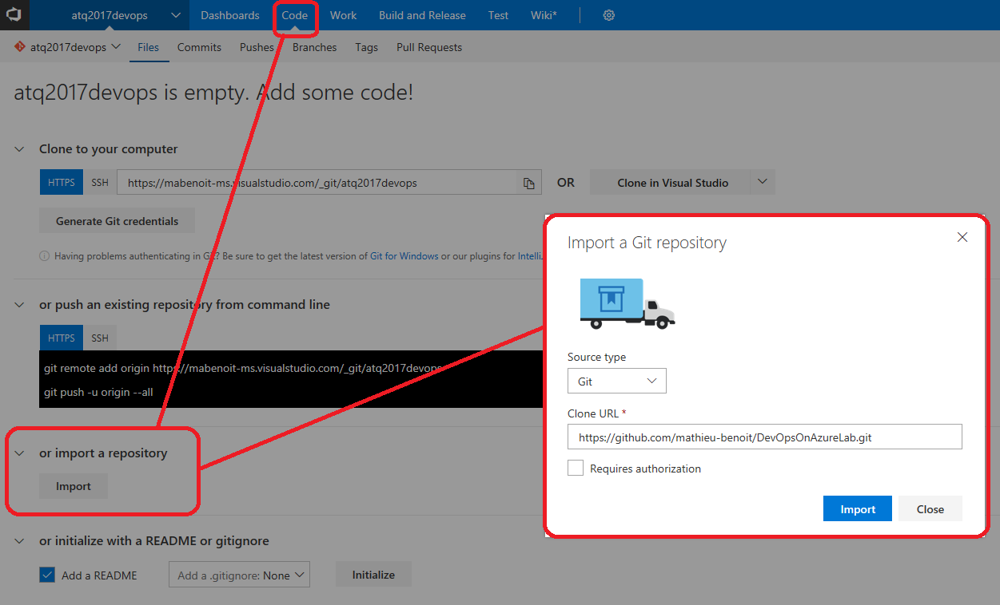
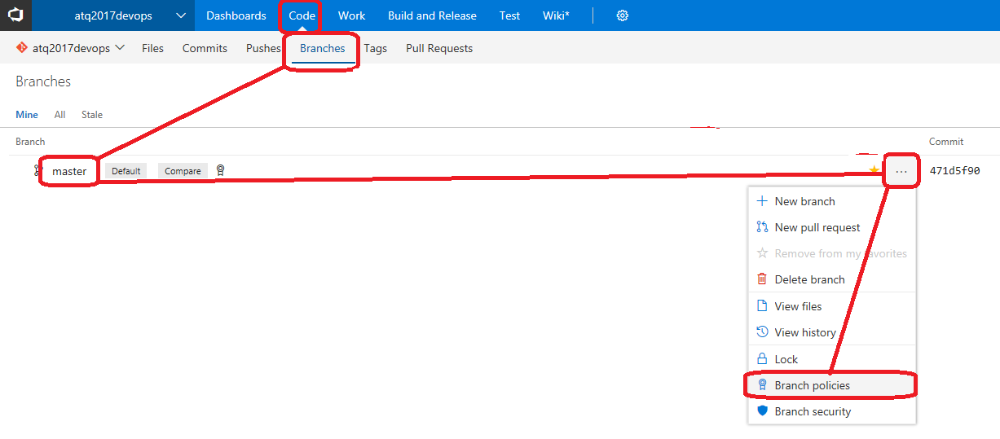
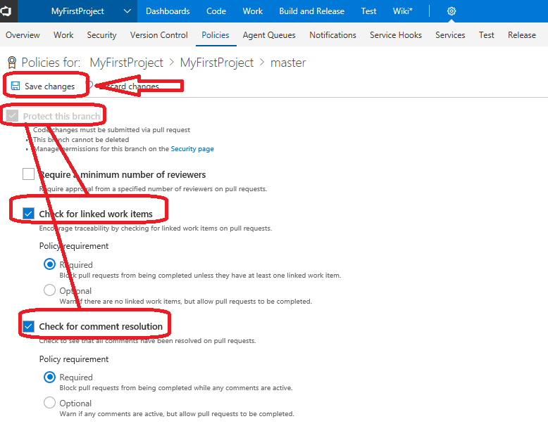
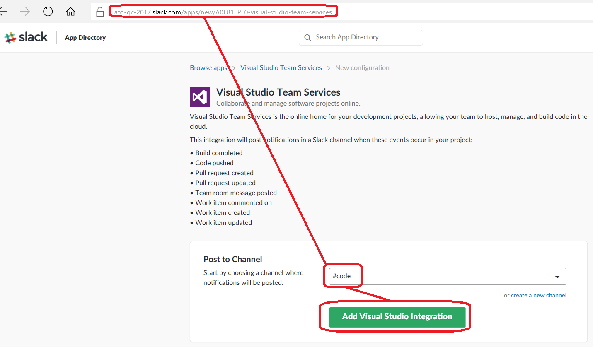
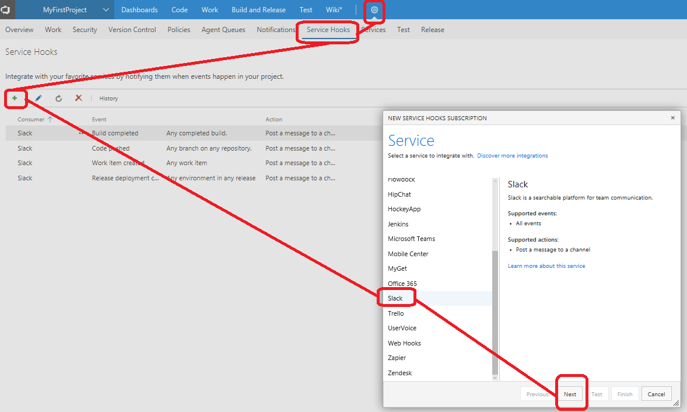
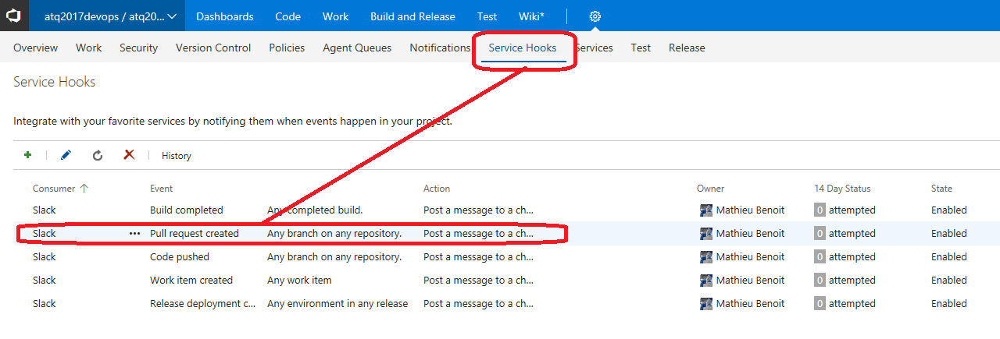

Previous lab: [Introduction](../Introduction/README.md)

# Lab 1 - Source control

Duration: 15 min

The goal of this lab is to setup a [Git source control with VSTS](https://docs.microsoft.com/en-us/vsts/git/overview) for a given application. 

Best practices highlighted:

- Use Git as decentralized source control
- Configuration of policies regarding branch, commit and pull request
- Automate the communication with your teammates through Slack notifications

You will go through 3 main sections in this lab:

- Import existing Git repository
- Setup branch policies
- Setup Slack notification for "Pull Request created"

## Import existing Git repository

1. Go to your VSTS account `https://<yourvstsaccount>.visualstudio.com` and open your existing empty project (default: "MyFirstProject", otherwise create a new one).
2. Navigate to the "Code" tab
3. Use the [Import into an existing empty repository](https://docs.microsoft.com/en-us/vsts/git/import-git-repository#import-into-an-existing-empty-repo) feature by hitting the "Import" button like illustrated on the image below.

4. Set the fields "Source type" to `Git` and "Clone URL" to `https://github.com/mathieu-benoit/DevOpsOnAzureLab.git` and click on "Import".

## Setup branch policies

5. Once the repository imported with the previous step, go to the "Code" tab and navigate to the "Branch policies" feature of the "master" branch like illustrated below:

6. Enable "Protect this branch" and then enable "Check for linked work items" and "Check for comment resolution" as well. Then, click on the "Save changes" toolbar button at the top of this page.

## Setup Slack notification for "Pull Request created"

7. Ensure you are already logged in your Slack account for this lab - `https://<youraccount>.slack.com`
8. Go to this new app configuration link: https://atq-qc-2017.slack.com/apps/new/A0F81FPF0-visual-studio-team-services, type the `#code` channel and click on "Add Visual Studio Integration".

9. Once the result page is displayed ("New integration added!"),  copy the "WebHook URL" field value `https://hooks.slack.com/services/...` to be used with the next steps. 

10. Go to the "Service Hooks" of the "Admin" page of your VSTS project and from there click on the "Create subscription" button like illustrated below.

11. On the next pages, select "Pull request created" for the "Trigger on this type of event" and let the default "Filters", Then click on "Next" to paste there the "Slack Webhook URL" value "https://hooks.slack.com/services/..." you copied from the Slack configuration we did earlier. Finally, click on "Finish" to see the new associated Service Hook entry:

(Optional) You could repeat the actions to setup the Slack notifications for other actions from VSTS like for example: Build completed, Release deployment completed, Work item created, Code pushed, etc.

You are now all set for this lab. All these concepts will be used and illustrated with the next labs.

Next lab: [Lab 02 - Continuous integration](../Lab%202%20-%20Continuous%20integration/README.md)