Previous lab: [Lab 1 - Source control](../Lab%201%20-%20Source%20control/README.md)

# Lab 2 - Continuous Integration

Duration: 45 min

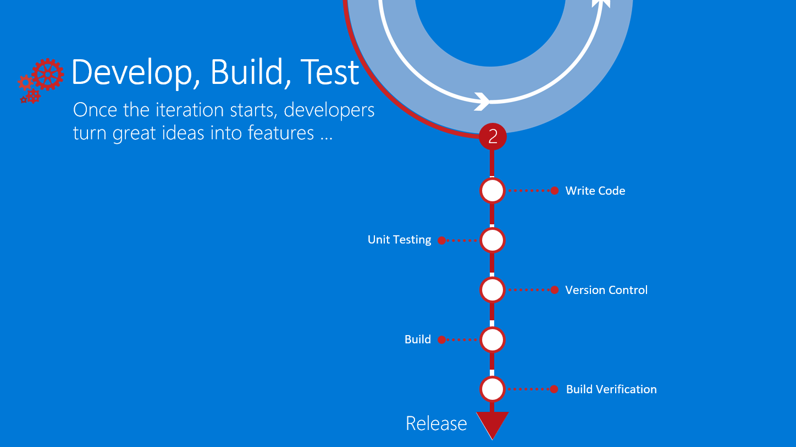

The goal of this lab is to configure the different steps of the Continuous Integration (CI) process for a given web app through a VSTS Build Definition. The basic concepts of a CI phase is to expose different artifacts which will be used during the next Continuous Delivery (CD) phase. You will finally trigger 2 builds to see what will happen: manually and auto-triggered by a commit. 

Best practices highlighted:

- Integrate unit tests during the CI process
- Trigger CI at each commit into master branch
- Create a work item on build failure as bug in the backlog
- Generate artifacts to be reused in a separate Continuous Delivery (CD) process
- Automate the communication with your teammates through Slack notifications

You will go through 3 main sections in this lab:

- Create the VSTS Build definition and expose the "app" artifact
- Fix the unit test issue by submitting a new branch and pull request
- Expose the "infra" and "ui-tests" artifacts

## Create the VSTS Build definition and expose the "app" artifact

1. Go to your VSTS account https://<yourvstsaccount.visualstudio.com
2. Navigate to the "Build and Release" tab and click on the "New definition" button:

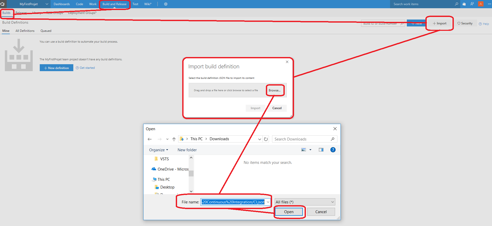

3. Select the "ASP.NET Core" template and click on the "Apply" button:


4. You will land on the "Tasks" tab of the Build definition page where you will have to define the "Agent Queue" field with the `Hosted VS2017` value, rename the "Name" by `CI` and change the "Project(s) to test" field from `**/*Tests/*.csproj` to `**/*UnitTests/*.csproj` and the "Project(s) to restore and build" field from `**/*.csproj` to:

```
src/MainWebApplication/MainWebApplication/MainWebApplication.csproj
src/MainWebApplication/MainWebApplicationUnitTests/MainWebApplicationUnitTests.csproj
```

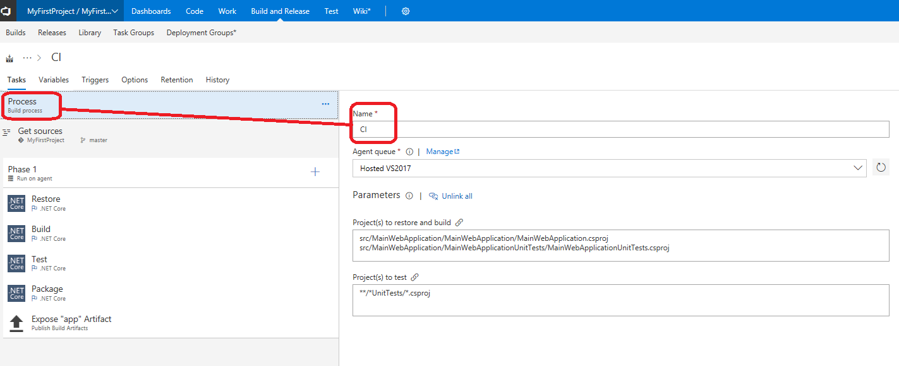

TODO - Update screenshot to have "**/*UnitTests/*.csproj"

5. Go to "Tasks" tab of this Build definition and click on the `Publish` step (4th) and rename it by `Package`. Go to the `Publish Artifact` step (5th) and rename it by `Expose "app" Artifact` and change the field "Artifact name" from `drop` to `app`. 

6. Navigate to the "Trigger" tab of this Build definition page and enable the "Trigger status" of the "Continuous Integration" section.

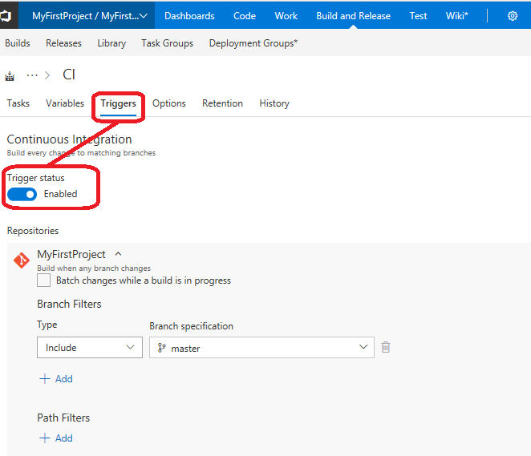

7. Navigate to the "Options" tab of this Build definition page and enable the "Create work item on failure" section.

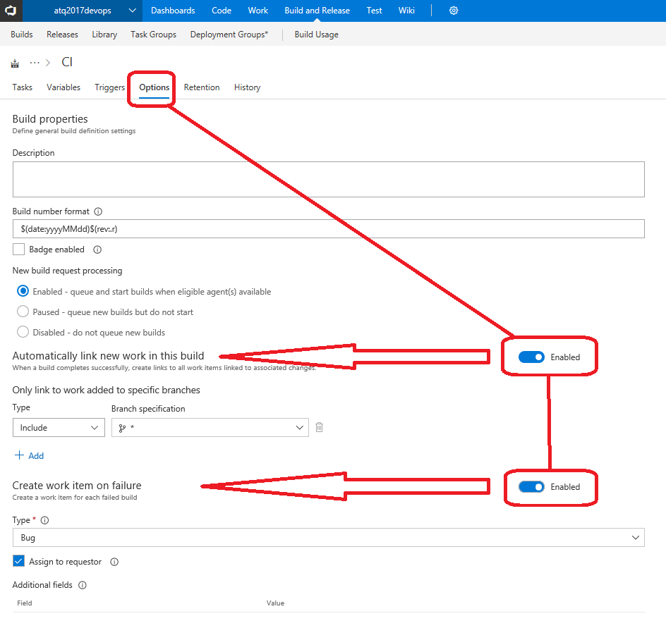

8. Then click on the "Save & queue" toolbar button. The "Save build definition and queue" will popup, leave the default parameter and click on the "Save & queue" button.
9. After ~2 min this build should failed because of a unit test failure:

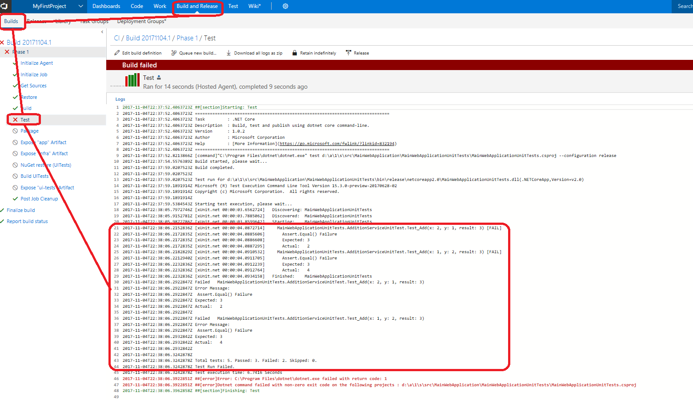

10. Here you should be able to see the different notifications related to this failure:

- In the current and default "Iteration 1" of the VSTS Work feature, you should see a new Bug Work Item.
- In Slack, you should see 2 notifications: 1 for the Build failed in the #build channel and 1 other for the Work Item created in the #work channel.

## Fix the unit test issue by submitting a new branch and pull request

11. Go to the VSTS "Code" main tab to create a new branch based on the master branch. Click on "New branch" action and name it as `fix-unit-test` and then click on the "Create branch" button:

TODO - Review the name of the branch with good practices? mathieu-benoit/fix-unit-test

TODO - Create branch from WorkItem instead to demonstrate the integration?

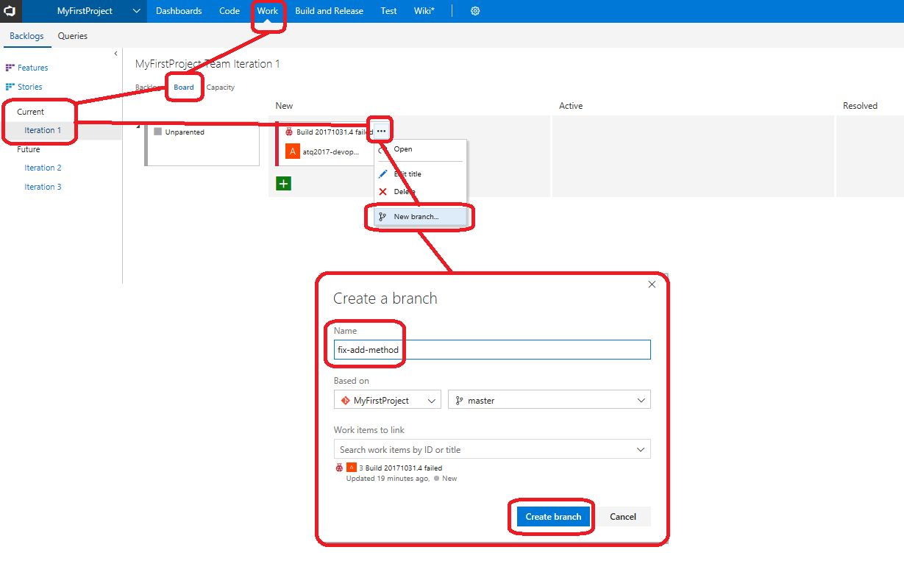

12. Navigate to the `src/MainWebApplication/MainWebApplicationUnitTests/SampleUnitTest.cs` file on this `fix-unit-test` branch. Click on the "Edit" button (top right hand corner) and then update the line 22 by replacing `return y + y;` by `return x + y;`. Click on the "Commit..." button (top right hand corner again) and on the "Commit" button once poped up.

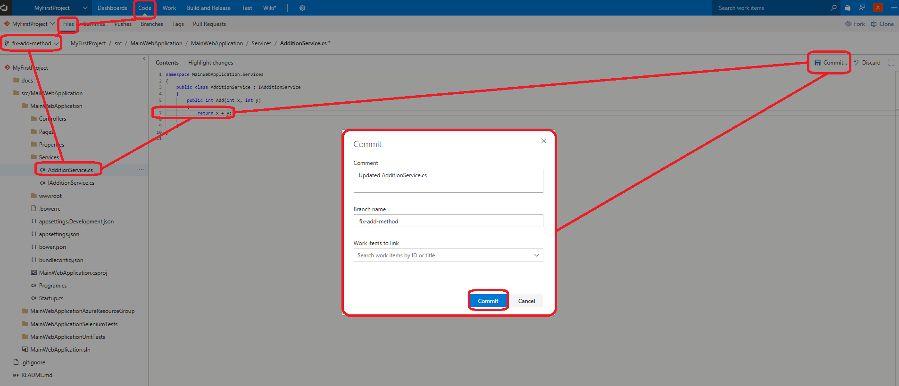

13. You will be invited to create a Pull Request based on this commit on this branch. Let's proceed and land on the Pull Request creation page:

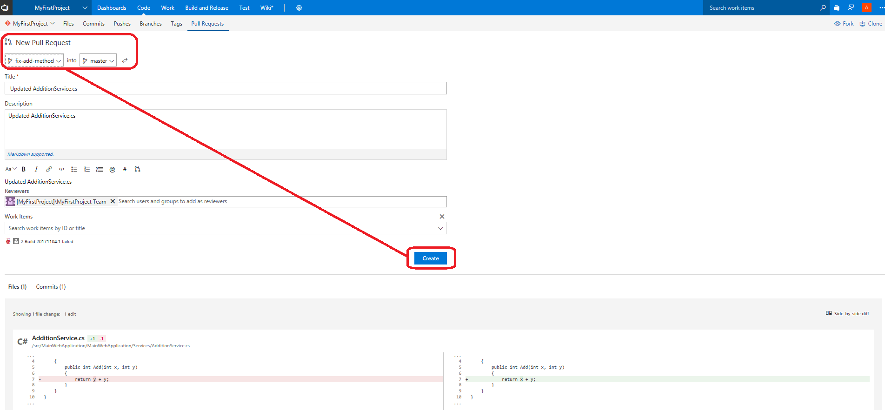

14. Comment the line updated on the right hand side and then ckick on the "Complete" action to finally confirm the popup by clicking on the "Complete merge" button.

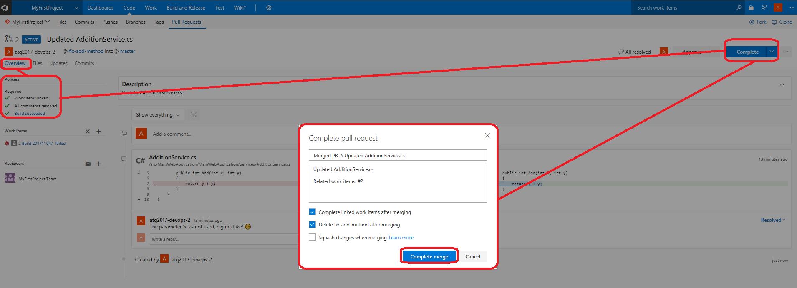

15. A new build will be triggered after the merge into master, it should be completed successfuly. Furthermore, you should see 2 new Slack notifications (Code pushed + Build completed).

## Generate and expose the "infra" and "ui-tests" artifacts

16. Duplicate the "Expose "app" artifact" and change the values: "Display name" into `Expose "infra" Artifact`, "Path to publish" into `src/MainWebApplication/MainWebApplicationAzureResourceGroup` and "Artifact name" into `infra`.

TODO - Add the fact that there is the "app" artifact.

TODO - Import Task Group instead of create manually the steps below

17. Add a new step - NuGet restore - TODO

18. Add a new step - Build UITest - MSBuild - TODO

19. Add a new step - Publish Build Artifacts - TODO

20. "Save and Queue" this build. Once it will be successfully completed you should see the 3 artifacts below and should see the Slack notifications as well:

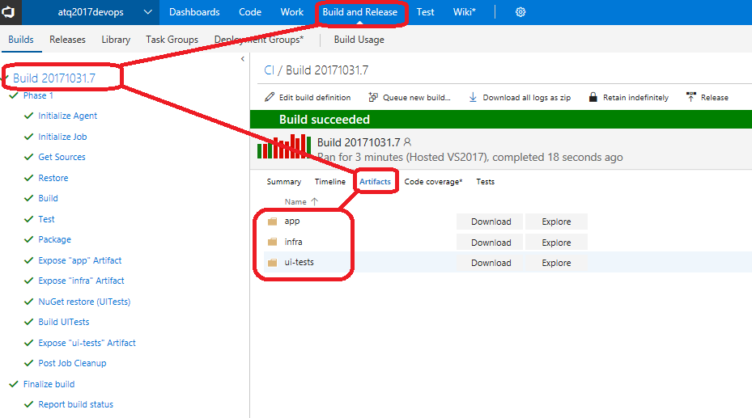

You are now all set for this lab. Let's see how the 3 artifacts of the CI will be used with the next lab.

Next lab: [Lab 3 - Continuous Delivery](../Lab%203%20-%20Continuous%20Delivery/README.md)