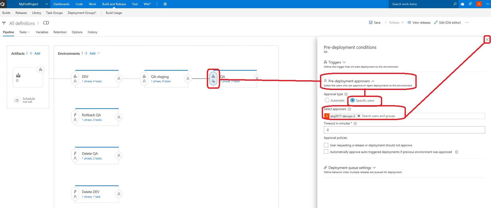
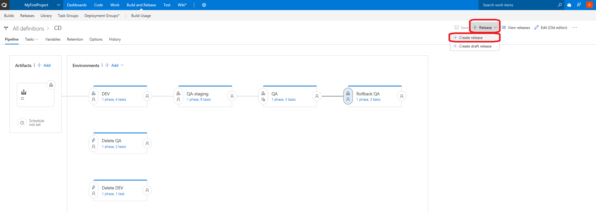
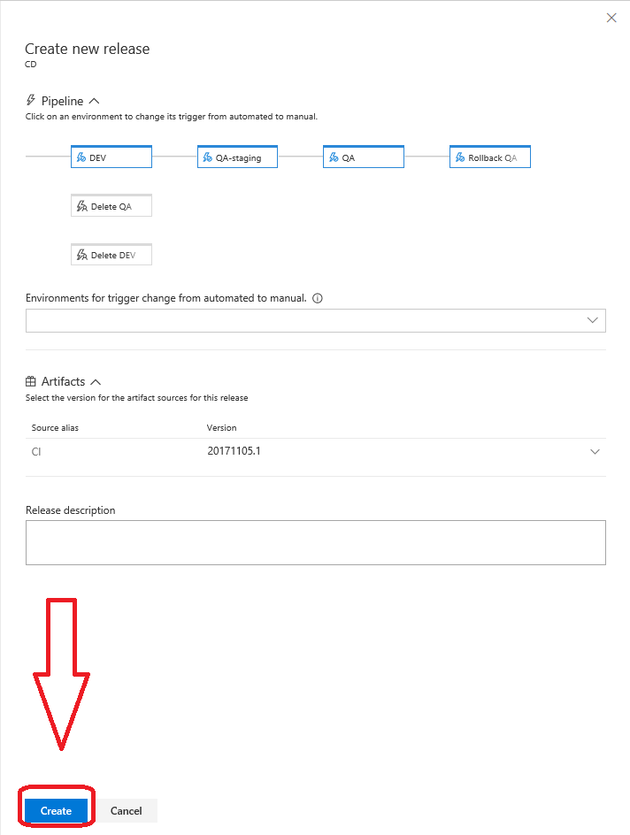
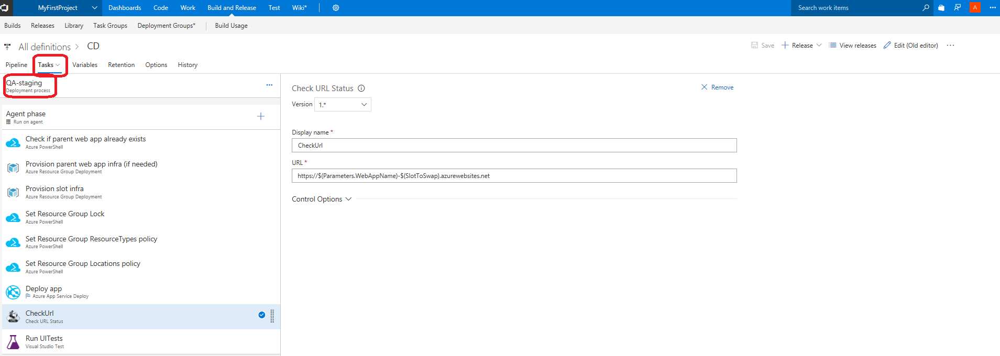
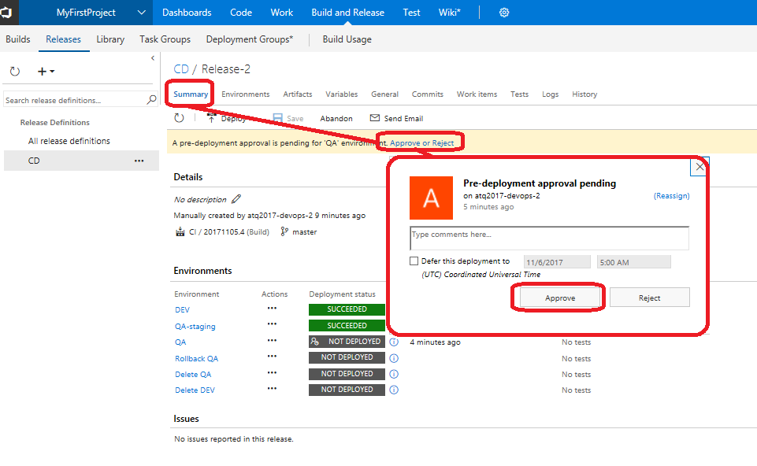

Previous lab: [Lab 2 - Continuous Integration](../Lab%202%20-%20Continuous%20Integration/README.md)

# Lab 3 - Continuous Delivery

Duration: 20 min

The goal of this lab is to ... 

Best practices highlighted:

- Use a dedicated version of the CI's artifacts (latest by default)
- Use Azure ARM Templates as Infrastructue-as-code exposed by the "Ops" team
- Store settings on the server - defined in the ARM Templates
- Run UITests
- Auto-trigger the CD when the associated CI is completed
- Automate the communication with your teammates through Slack notifications

You will go through 4 main sections in this lab:

- Create a Release definition
- Deploy the infrastructure and the app
- Run the UITests

## Create the Release definition to deploy the "app" artifact in DEV environment

1. Go to your VSTS account `https://<yourvstsaccount>.visualstudio.com` and open your VSTS project for this lab

2. Navigate to the **Build and Release** > **Release** tab

*Note: For the Agile Tour Quebec 2017, skip the next steps 3 and 4 and start at step 5. These steps have already been done for you to save some time for your lab, so just start by editing the `CD` Release definition.*

3. Click on the **Import** button on the top left hand corner to import the file below. Copy/paste this path into the **File name** field and then click on **Open** and finally **Import**:

`
https://raw.githubusercontent.com/mathieu-benoit/DevOpsOnAzureLab/master/docs/Lab%203%20-%20Continuous%20Delivery/CD.json
`

4. After the import, rename the Release definition as `CD` and go to the **Tasks** tab of this Release definition and apply the actions below for each Environment: `DEV`, `QA-staging`, `QA`, `Delete QA-staging and QA` and `Rollback QA`:

- Set the **Agent queue** of the **Run on agent** step to `Hosted VS2017`
- Set the **Azure subscription** of the first step **Deployment process** to `Azure Paas - Connection`

5. Go to the **Variables** tab of this Release definition and change the value of the `AppServiceName` variable to your correct and unique username, for example: `atq2017devopsXX`. This name should be unique otherwise it will failed while deploying the Azure Web App.

6. Go to the **Pipeline** tab of this Release definition and click on **Add artifact** on the left side of this screen:

7. On this artifact let's enable the **Continuous deployment trigger** by selecting `master` as the **Build branch**:

8. On the **QA** Environment, click on its left side to customize its **Pre-deployment conditions** and set yourself as **Pre-deployment approvers**:

9. On the **Rollback QA** Environment do the exact same setup.

10. On the same **Pre-deployment conditions** setup page of this **Rollback QA** Environment, change the trigger type to `After environment` and select the `QA` Environement:

11. **Save** your changes and then let's manually trigger **Release** > **Create release** now we are ready:

12. Leave the default information and just click on the **Create** button:

*Note: the duration of this release should take ~6 min. By waiting you could go to the next section to explore the different tasks of this Release definition.*

## Let's explore the tasks/steps of these environments

13. DEV

14. QA-Staging

15. QA

16. Rollback QA

17. Delete QA

## Approve manually the deployment from "QA-staging" to "QA"

18. Navigate to **Build and Release** > **Release**, select your `CD` and double click on the latest Release executed (the one you manually triggered earlier):

19. Once `DEV` and `QA-staging` are successfuly deployed, you should be able to clik on **Approve or Reject** and then **Approve** to deploy `QA`:

## Browse the Azure resources

TODO - Go to the Azure portal...

Next lab: [Lab 4 - Monitor and Learn](../Lab%204%20-%20Monitor%20and%20Learn/README.md)