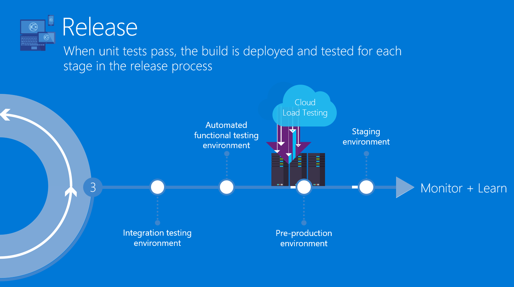
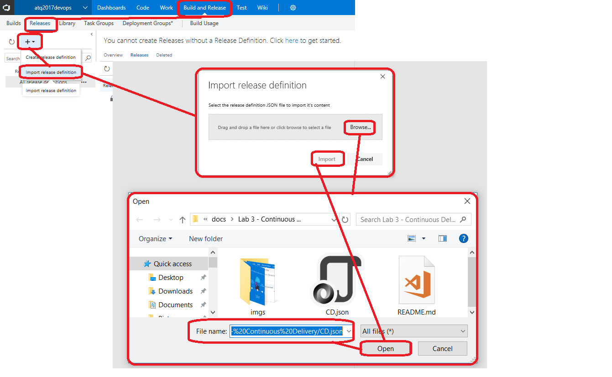
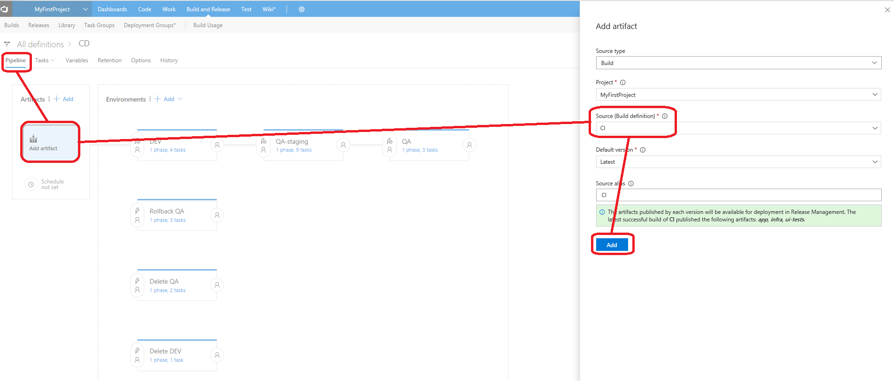
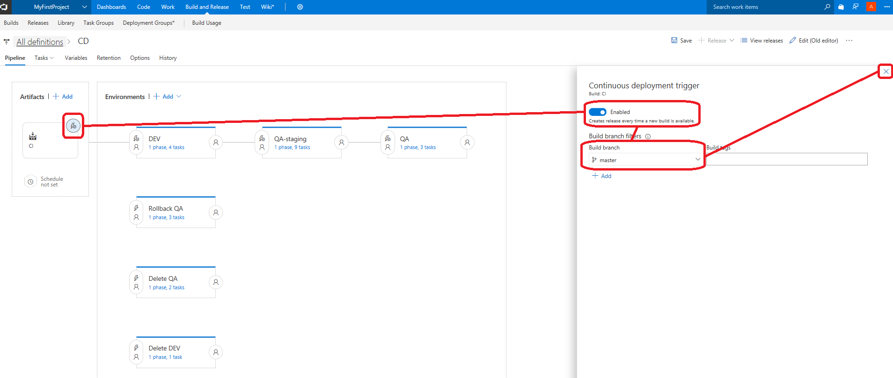

Previous lab: [Lab 2 - Continuous Integration](../Lab%202%20-%20Continuous%20Integration/README.md)

# Lab 3 - Continuous Delivery

Duration: 20 min

The goal of this lab is to ... 

Best practices highlighted:

- Use a dedicated version of the CI's artifacts (latest by default)
- Use Azure ARM Templates as Infrastructue-as-code exposed by the "Ops" team
- Store settings on the server - defined in the ARM Templates
- Run UITests
- Auto-trigger the CD when the associated CI is completed
- Automate the communication with your teammates through Slack notifications

You will go through 4 main sections in this lab:

- Create a Release definition
- Deploy the infrastructure and the app
- Run the UITests

## Create the Release definition to deploy the "app" artifact in DEV environment

1. Go to your VSTS account `https://<yourvstsaccount.visualstudio.com` and open your VSTS project for this lab
2. Navigate to the "Release" sub-tab of the "Build and Release" tab and click on the "Import" button on the top right hand corner to import the file below. Copy/paste this path into the "File name" field and then click on "Open" and finally "Import":

`
https://raw.githubusercontent.com/mathieu-benoit/DevOpsOnAzureLab/master/docs/Lab%203%20-%20Continuous%20Delivery/CD.json
`

3. After the import, rename the Release definition as `CD` and go to the "Tasks" tab of this Release definition and apply the actions below for each Environment: `DEV`, `QA-staging`, `QA`, `Delete QA-staging and QA` and `Rollback QA`:

- Set the "Agent queue" of the "Run on agent" step to `Hosted VS2017`
- Set the "Azure subscription" of the first step "Deployment process" to `Azure Paas - Connection`

4. Go to the "Pipeline" tab of this Release definition and add our "CI" Build as artifact:

5. On this artifact let's enable the "Continuous deployment trigger":

6. Go to the "Variables" tab of this Release definition and change the value of the `AppServiceName` variable to your correct and unique username, for example: `atq2017devopsXX`. This name should be unique otherwise it will failed while deploying the Azure Web App.

7. "Save" your changes and let's trigger a "Release" now we are ready ...

8. Once successfuly deployed, you should see this summary for this Release:

TODO: update this img below with the work items, etc.

## (Optional) Let's customize a bit this pipeline

Configure Manual approval

Configure Rollback if deployed link

Configure Production link with QA duplication

Add RG Lock + Policies

## Browse the Azure resources

Go to the Azure portal...

Next lab: [Lab 4 - Monitor and Learn](../Lab%204%20-%20Monitor%20and%20Learn/README.md)