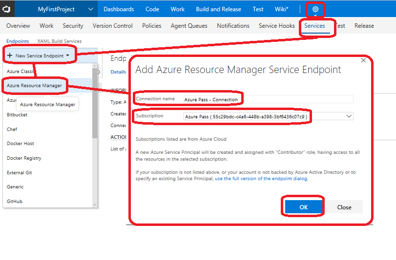
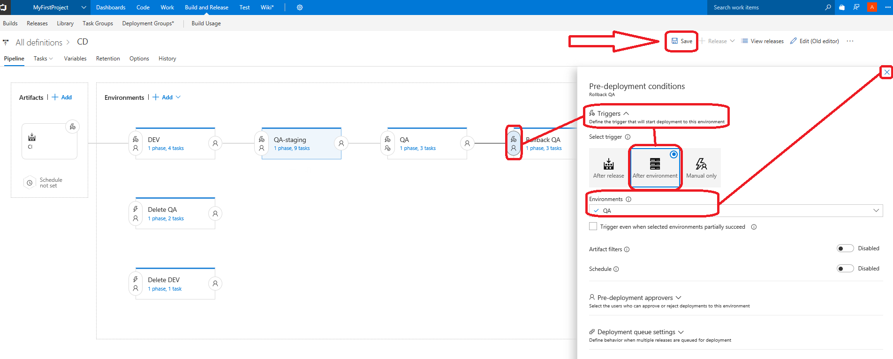

Previous lab: [Lab 2 - Continuous Integration](../Lab%202%20-%20Continuous%20Integration/README.md)

# Lab 3 - Continuous Delivery

Duration: 25 min

The goal of this lab is to configure the different steps of the Continuous Delivery (CD) process for a given web app through a VSTS Release Definition. The basic concepts of a CD phase is to deploy the different artifacts exposed by the CI phase: deploy the `infra` artifact, then the `app` artifact to finally run the `ui-tests` artifact on the different environements: `DEV`, `QA`, etc. You will finally trigger the release to be able then to browse the web app endpoints deployed. 

Best practices highlighted:

- Use a dedicated version of the CI's artifacts (latest by default)
- Use Azure ARM Templates as Infrastructue-as-code exposed by the "Ops" team
- Store settings on the server - defined in the ARM Templates
- Run UITests
- Auto-trigger the CD when the associated CI is completed
- Deploy the web app on Azure App Service to take advantage of the Cloud infrastructure and capabilities
- Automate the communication with your teammates through Slack notifications

You will go through 5 main sections in this lab:

- Configure the CheckUrl extension and the Azure Resource Manager service endpoint and import a pre-built Release definition
- Edit and customize the imported Release definition
- Let's explore the tasks/steps of these environments
- Approve manually the deployment from `QA-staging` to `QA`
- Browse the Azure resources

## Configure the CheckUrl extension and the Azure Resource Manager service endpoint and import a pre-built Release definition

*Note: For the Agile Tour Quebec 2017, skip this section and [go directly to the next section](#edit-and-customize-the-imported-release-definition). These steps have already been done for you to save some time for your lab, so just start by editing the `CD` Release definition.*

- Go to your VSTS account `https://<yourvstsaccount>.visualstudio.com` and open your VSTS project for this lab

- Install the CheckUrl extension - https://marketplace.visualstudio.com/items?itemName=saeidbabaei.checkUrl
- Configure an Azure Resource Manager endpoint for example with the name `Azure Paas - Connection`:

Note: after the creation of this endpoint an Azure user is created as `Contributor`. Azure Resource Group policies and lock will be applied later on this lab and because the `Contributor` role doesn't have write rights on `Microsoft.Authorization/locks/`, `Microsoft.Authorization/policydefinitions/` or `Microsoft.Authorization/policyassignments/`, so:
- either you add these right to the associated user via the Azure portal;
- or you disable the 3 associated tasks in the `QA-staging` Environment.

- Navigate to the **Build and Release** > **Release** tab
- Click on the **Import** button on the top left hand corner to import the file below. Copy/paste this path into the **File name** field and then click on **Open** and finally **Import**:

*Note: if you don't have any Release definition yet, you should create an empty Release definition first to have access to the import feature.*

`
https://raw.githubusercontent.com/mathieu-benoit/DevOpsOnAzureLab/master/docs/Lab%203%20-%20Continuous%20Delivery/CD.json
`

- After the import, rename the Release definition as `CD` and go to the **Tasks** tab of this Release definition and apply the actions below for each Environment: `DEV`, `QA-staging`, `QA`, `Rollback QA`, `Delete QA` and `Delete DEV`:
  - Set the **Agent queue** of the **Run on agent** step to `Hosted VS2017`
  - Set the **Azure subscription** of the first step **Deployment process** to `Azure Paas - Connection`

## Edit and customize the imported Release definition

1. Go to your VSTS account `https://<yourvstsaccount>.visualstudio.com` and open your VSTS project for this lab

2. Navigate to the **Build and Release** > **Release** tab and click on the **Edit** action:

3. Go to the **Variables** tab of this Release definition and change the value of the `AppServiceName` variable to your correct and unique username, for example: `atq2017devopsXX`. This name should be unique otherwise it will failed while deploying the Azure Web App.

4. Go to the **Pipeline** tab of this Release definition and click on **Add artifact** on the left side of this screen:

5. On this artifact let's enable the **Continuous deployment trigger** by selecting `master` as the **Build branch**:

6. On the **QA** Environment, click on its left side to customize its **Pre-deployment conditions** and set yourself as **Pre-deployment approvers**:

7. On the **Rollback QA** Environment do the exact same setup.

8. On the same **Pre-deployment conditions** setup page of the **Rollback QA** Environment, change the trigger type to `After environment` and select the `QA` Environement:

9. **Save** your changes and then let's manually trigger **Release** > **Create release** now we are ready:

10. Leave the default information and just click on the **Create** button:

*Note: the duration of this release should take ~6 min. By waiting you could go to the next section to explore the different tasks of this Release definition.*

## Let's explore the tasks/steps of these environments

11. DEV

12. QA-Staging

13. QA

14. Rollback QA

15. Delete QA

16. Delete DEV

## Approve manually the deployment from "QA-staging" to "QA"

17. Navigate to **Build and Release** > **Release**, select your `CD` and double click on the latest Release executed (the one you manually triggered earlier):

18. Once `DEV` and `QA-staging` are successfuly deployed, you should be able to clik on **Approve or Reject** and then **Approve** to deploy `QA`:

## Browse the Azure resources

19. Navigate to [https://portal.azure.com](https://portal.azure.com) where you should be able to see your Azure resources deployed:

20. Browse the `DEV` Azure Web App to see the homepage of the web app you have deployed on it:

You are now all set for this lab. Let's now see what are the tools in place for the monitoring and learning pieces with the next lab.

Next lab: [Lab 4 - Monitor and Learn](../Lab%204%20-%20Monitor%20and%20Learn/README.md)